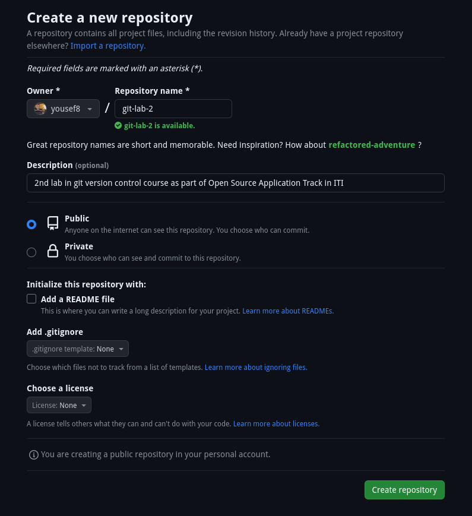

# Lab 2

## 1. Create new project on local maching, then push it to remote repo

1. **Create Remote Repo**
  
    

1. **Create Local Repo and push it to Remote Repo**

    

## 2. Create 2 branches (dev & test), then create a file in each of them, then push them to remote repo

1. **Create Branches**

    

1. **Create a file in each branch**

    
    

1. **Push Changes to Remote Repo**

    

## 3. Merge these changes on Main branch and then push it to remote repo


## 4. How to remove branches locally and remotely

1. **Locally**

    ```text
    git branch -d dev

    git branch -d test
    ```

1. **Remotely**

    ```text
    git push origin :dev

    git push origin :test
    ```

## 5. How to checkout another branch without commit changes?

* If there are changes in the working copy that aren't commited and trying to switch branch `git` will complain with an error that these edits will get deleted if branch is switched you will have to either delete the edits or commit it first

* Another solution is to `stach` the uncommited changes and then switching the branch

## 6. Create an annotated tag with tagname `v1.7`


## 7. Push it to the remote Repo


## 8. How to list tags


## 9. How to delete tag locally and remotely

1. **Remotely**

    

    

1. **Locally**

    

## 10. Add an image to README.md file


